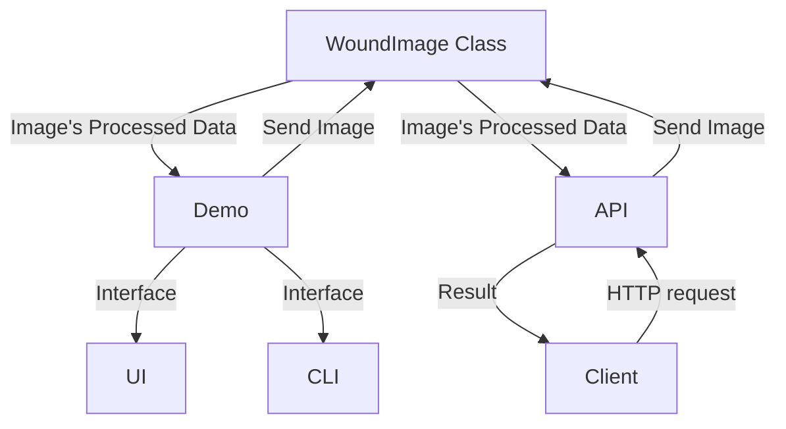
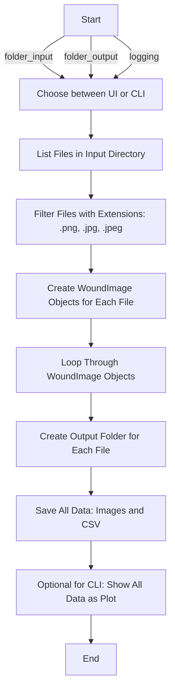
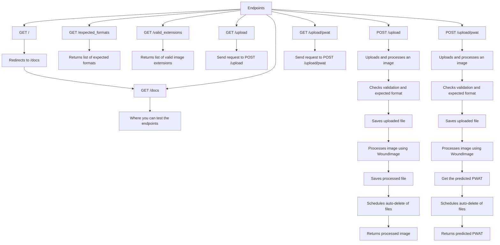
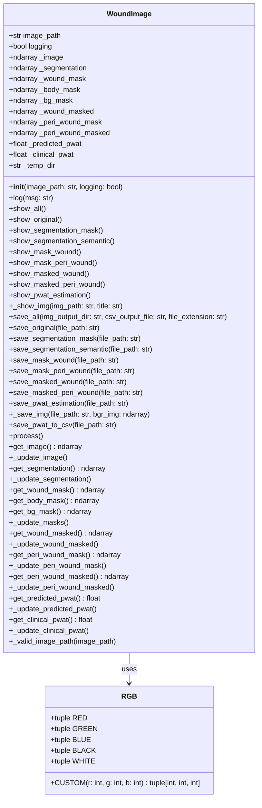

# Schemes

## General

```mermaid
graph TD
    WI[WoundImage Class]
    DEMO[Demo]
    API[API]
    CLIENT[Client]
    UI[UI]
    CLI[CLI]

    DEMO -->|Send Image| WI -->|Image's Processed Data| DEMO
    API -->|Send Image| WI -->|Image's Processed Data| API
    CLIENT -->|HTTP request| API -->|Result| CLIENT
    DEMO -->|Interface| UI
    DEMO -->|Interface| CLI
```

## Demo

```mermaid
graph TD
    START[Start]
    MODE[Choose between UI or CLI]
    LIST[List Files in Input Directory]
    FILTER[Filter Files with Extensions: .png, .jpg, .jpeg]
    INIT[Create WoundImage Objects for Each File]
    LOOP[Loop Through WoundImage Objects]
    FOLDER[Create Output Folder for Each File]
    SAVE[Save All Data: Images and CSV]
    PLOT[Optional for CLI: Show All Data as Plot]
    END[End]

    START -->|folder_input| MODE
    START -->|folder_output| MODE
    START -->|logging| MODE
    MODE --> LIST --> FILTER --> INIT --> LOOP --> FOLDER --> SAVE --> PLOT --> END
```

## API

```mermaid
graph TD
    ENDPOINTS[Endpoints]

    ROOT[GET /]
    ROOT1[Redirects to /docs]

    DOCS[GET /docs]
    DOCS1[Where you can test the endpoints]

    FORMAT[GET /expected_formats]
    FORMAT1[Returns list of expected formats]

    EXTENSION[GET /valid_extensions]
    EXTENSION1[Returns list of valid image extensions]

    GETUPLOAD[GET /upload]
    GETUPLOAD1[Send request to POST /upload]
    UPLOAD[POST /upload]
    UPLOAD1[Uploads and processes an image]
    UPLOAD2[Checks validation and expected format]
    UPLOAD3[Saves uploaded file]
    UPLOAD4[Processes image using WoundImage]
    UPLOAD5[Saves processed file]
    UPLOAD6[Schedules auto-delete of files]
    UPLOAD7[Returns processed image]

    GETPWAT[GET /upload/pwat]
    GETPWAT1[Send request to POST /upload/pwat]
    PWAT[POST /upload/pwat]
    PWAT1[Uploads and processes an image]
    PWAT2[Checks validation and expected format]
    PWAT3[Saves uploaded file]
    PWAT4[Processes image using WoundImage]
    PWAT5[Get the predicted PWAT]
    PWAT6[Schedules auto-delete of files]
    PWAT7[Returns predicted PWAT]

    ENDPOINTS --> ROOT --> ROOT1 --> DOCS
    ENDPOINTS --> DOCS --> DOCS1
    ENDPOINTS --> FORMAT --> FORMAT1
    ENDPOINTS --> EXTENSION --> EXTENSION1
    ENDPOINTS --> GETUPLOAD --> GETUPLOAD1
    ENDPOINTS --> GETPWAT --> GETPWAT1
    ENDPOINTS --> UPLOAD --> UPLOAD1 --> UPLOAD2 --> UPLOAD3 --> UPLOAD4 --> UPLOAD5 --> UPLOAD6 --> UPLOAD7
    ENDPOINTS --> PWAT --> PWAT1 --> PWAT2 --> PWAT3 --> PWAT4 --> PWAT5 --> PWAT6 --> PWAT7
```

## Source

```mermaid
classDiagram
    class WoundImage {
        +str image_path
        +bool logging
        +ndarray _image
        +ndarray _segmentation
        +ndarray _wound_mask
        +ndarray _body_mask
        +ndarray _bg_mask
        +ndarray _wound_masked
        +ndarray _peri_wound_mask
        +ndarray _peri_wound_masked
        +float _predicted_pwat
        +float _clinical_pwat
        +str _temp_dir
        +__init__(image_path: str, logging: bool)
        +log(msg: str)
        +show_all()
        +show_original()
        +show_segmentation_mask()
        +show_segmentation_semantic()
        +show_mask_wound()
        +show_mask_peri_wound()
        +show_masked_wound()
        +show_masked_peri_wound()
        +show_pwat_estimation()
        +_show_img(img_path: str, title: str)
        +save_all(img_output_dir: str, csv_output_file: str, file_extension: str)
        +save_original(file_path: str)
        +save_segmentation_mask(file_path: str)
        +save_segmentation_semantic(file_path: str)
        +save_mask_wound(file_path: str)
        +save_mask_peri_wound(file_path: str)
        +save_masked_wound(file_path: str)
        +save_masked_peri_wound(file_path: str)
        +save_pwat_estimation(file_path: str)
        +_save_img(file_path: str, bgr_img: ndarray)
        +save_pwat_to_csv(file_path: str)
        +process()
        +get_image() ndarray
        +_update_image()
        +get_segmentation() ndarray
        +_update_segmentation()
        +get_wound_mask() ndarray
        +get_body_mask() ndarray
        +get_bg_mask() ndarray
        +_update_masks()
        +get_wound_masked() ndarray
        +_update_wound_masked()
        +get_peri_wound_mask() ndarray
        +_update_peri_wound_mask()
        +get_peri_wound_masked() ndarray
        +_update_peri_wound_masked()
        +get_predicted_pwat() float
        +_update_predicted_pwat()
        +get_clinical_pwat() float
        +_update_clinical_pwat()
        +_valid_image_path(image_path)
    }

    class RGB {
        +tuple RED
        +tuple GREEN
        +tuple BLUE
        +tuple BLACK
        +tuple WHITE
        +CUSTOM(r: int, g: int, b: int) tuple[int, int, int]
    }

    WoundImage --> RGB : uses
```
